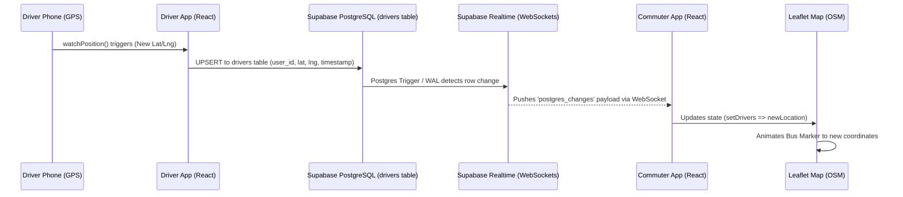
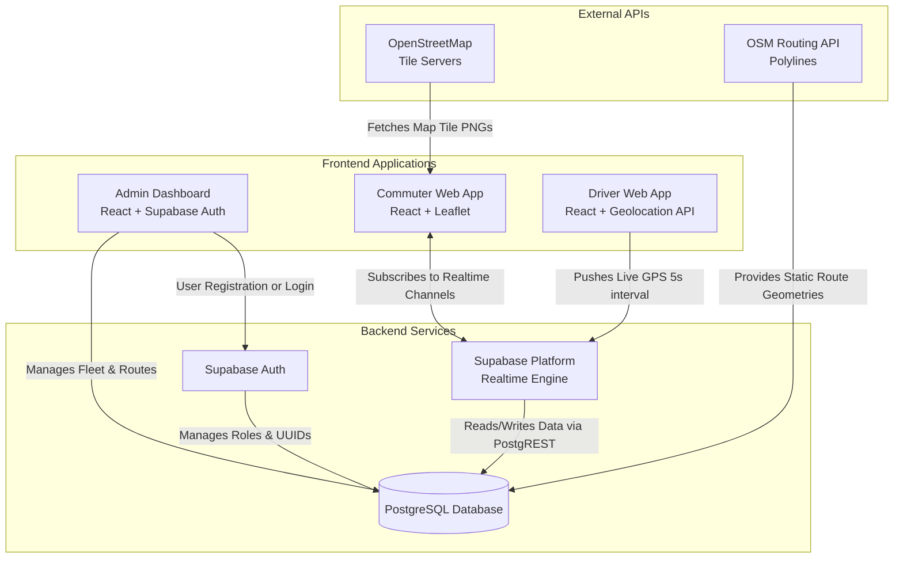

# TransitFlow System Diagrams

Below are the accurate Mermaid diagrams representing the process flow and system architecture for the TransitFlow project. You can render these directly in markdown viewers (like GitHub) or use [Mermaid Live Editor](https://mermaid.live/) to export them as images for your presentation.

## 1. Live Tracking Sequence Diagram
This diagram shows the exact flow of data from the driver's physical phone to the commuter's screen.

---

## 2. System Architecture Graph
This flowchart illustrates the relationships between the Frontend Applications, the Supabase Backend Services, and External Mapping APIs.

